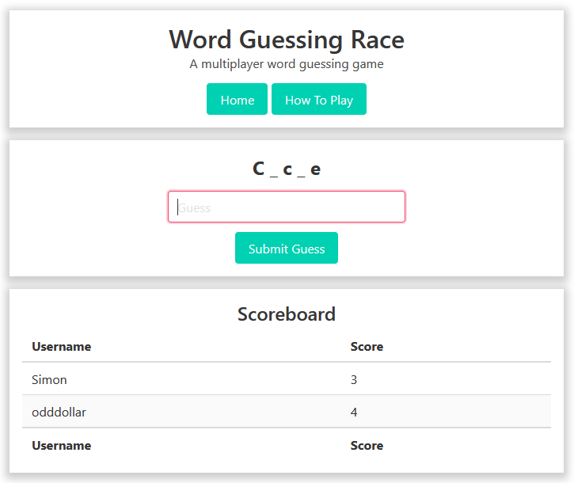
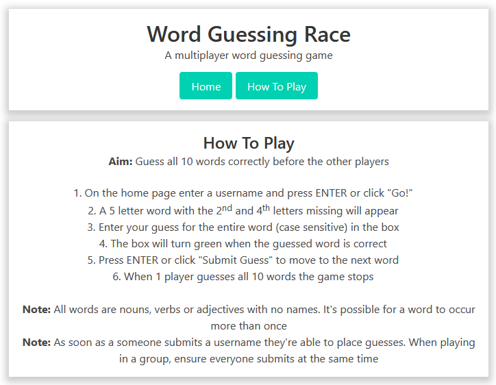

# Word Guessing Race

Word Guessing Race is a creatively named multiplayer game where the goal is to correctly guess all the words before the other players.

## Gameplay

1. Set a username
2. A 5-letter word will appear, missing its 2<sup>nd</sup> and 4<sup>th</sup> characters
3. The word will be a noun, adjective or verb
4. The entry box will change colour depending on whether or not the guess is correct
5. Once a correct word is entered the player can progress to the next word
6. When a player guesses all 10 words correctly the game ends for everyone

## Running/building

Built with Go's [Gin](https://gin-gonic.com/) framework, vanilla JavaScript and [Bulma CSS](https://bulma.io/), the game is run in a Docker container. Build as you would a normal container, exposing port 8080. For example:

```
git clone https://github.com/odddollar/Word-guessing-race.git
cd Word-Guessing-Race
docker build -t word-guessing-race .
docker run -d -p 8080:8080 word-guessing-race
```

The container can be made available to users outside your local network with a service like [Ngrok](https://ngrok.com/).

**Note:** A game is a single running container. To restart the game it's necessary to restart the Docker container.

## Screenshots




